```
     __  ____________                                             
    /  |/  / ____/   |_      _____  _________  ____ ___  ___      
   / /|_/ / /_  / /| | | /| / / _ \/ ___/ __ \/ __ `__ \/ _ \     
  / /  / / __/ / ___ | |/ |/ /  __(__  ) /_/ / / / / / /  __/     
 /_/  /_/_/   /_/  |_|__/|__/\___/____/\____/_/ /_/ /_/\___/      
```

[[_TOC_]]

# **MFAwesome: CLI Multi Factor Authenticaton**

# Summary

**MFAwesome** is an open-source system cross-platform command line based
multifactor authentication tool. It allows secure storage of your TOTP
and HOTP secrets in a simple config file that can be exported for use
even on systems you do not trust. It allows importing secrets via Google
Authenticator QR codes (requires
[QRScan](https://github.com/sayanarijit/qrscan)), keylogger protection,
fuzzy matching on secret names, multiple encryption options and
automatic synchronization via public NTP servers (custom NTP sever can
be set in the config). It is faster and easier for those accustomed to
CLI than using an app on your phone.

The bottom line is this: if your second method of authentication for
your accounts is on available on your phone - including email, text,
phone call or app - if your phone is not in your possession then you
might as well not have 2FA at all.

# Preview

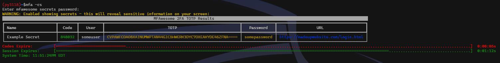

# Requirements

Python:

`python>=3.11`

Python Libraries:

-   `rich` (CLI Display output)
-   `pyyaml` (Config/Secrets storage)
-   `cryptography` (Secrets encryption)
-   `click` (CLI Arguments)

Optional dependencies:

-   `protobuf` (Importing from Google Authenticator)
-   `requests` (verifying internet connectivity)
-   `icmplib` (verifying internet connectivity)
-   `dnspython` (verifying internet connectivity)

External Dependencies:

QRCodes:

-   [QRScan](https://github.com/sayanarijit/qrscan) (for scanning QR
    images)

| :zap:  NOTE |
| ----------- |

*It has recently come to our attention that certain QR
codes, such as those used by Paypal do not scan correctly using this
app. This will be fixed in a future update.*

# Installation

There are several methods to test/install MFAwesome on your system.

## PyPI: The standard way

MFAwesome is on `PyPI`. By using PyPI, you will be using the latest
stable version.

-   To install MFAwesome, simply use `pip`:

`pip install --user mfawesome`

-   For a full installation (with all features):

*Note: You will need to install the Rust package \`\`QRScan\`\` in order
to utilize this feature*

`pip install --user mfawesome[all]`

-   To upgrade MFAwesome to the latest version:

`pip install --user --upgrade mfawesome`

-   To install the latest development version:

`git clone git@gitlab.com:robpersonal1/mfawesome.git`

or...

`git clone https://gitlab.com/robpersonal1/mfawesome.git`

then ...

`cd mfawesome`

`python -m setup.py install`

# Config File

The config file is normally named "mfawesome.conf" (unless specifying
via environment variable) and is formatted in
[YAML](https://yaml.org/spec/1.2.2/). It's location is checked for in
the following resolution order:

1.  MFAWESOME_CONFIG environment variable (full file name with path)
2.  Local directory for mfawesome.conf
3.  \~/mfawesome.conf (profile home)
4.  \~/.config/mfawesome/mfawesome.conf

**ALL** secrets are entered in the config file, either manually while it
is not encrypted or via the command line using `--addqrsecrets` and
`--addsecrets` (removal via `--removesecret`). Other metadata is fine to
enter in the yaml config file and will be encrypted along with the
secrets. The only *required* sections in the config file is `secrets`.

`--addsecrets` takes a single parameter which must be in the form of
json/python dictionary, i.e.:

`{"secretname": {"totp":"SECRETCODE", "user":"theduke", "url":"www.example.com"}}`

The active config file in use can be located via `--configdebug`
(similar to `pip config debug`). The option `--exportconfig` can be used
to export the existing secrets in the config file.

The option `--printconfig` can be used to \[decrypt\] and display the
full config file (*subjecting it to command line output logging*).

A double underscore - `__disabled_secret` in the `secrets` section of
the config will disable the TOTP/HOTP calculation for that secret.

# NTP Time Servers

A list of time servers to use can be specified either via the `NTP_SERVERS` environment variable or within the config file.

# Environment Variables

All environment variables take precedence over the config file, but not over manually passed arguments.  Secrets cannot be stored in environment variables.

## MFAWESOME_CONFIG

The environment variable `MFAWESOME_CONFIG`, if set, will be used as the path to the config file.  If the file does not exist or is invalid and exception will be raised

## MFAWESOME_PWD

The environment variable `MFAWESOME_PWD`, if set, will be used as the password to decrypt secrets.  An attempt to decrypt or export secrets will still request that the password be entered for validation.

:zap:  ***NOTE:*** *It is recommended to only store your password this way on machines that you trust.  nvironment variables can be logged.*

## MFAWESOME_LOGLEVEL

If set `MFAWESOME_LOGLEVEL` will override the setting in the config file, but not the level passed as a command line argument using `--loglevel`.

## NTP_SERVERS

The environment variable `NTP_SERVERS` can be specified as a colon `:` separated list of NTP time servers.  If none exist MFAwesome will fall back to the local system time, which if incorrect, will cause time based codes to be incorrect.  A warning will be displayed if this is the case.

## MFAWESOME_TEST

This environment variable is only used for testing, do not enable.

# Encryption Details

Password hashing is accomplished via
[Scrypt](https://www.tarsnap.com/scrypt/scrypt.pdf) and the encryption
cipher is
[ChaCha20-Poly1305](https://en.wikipedia.org/wiki/ChaCha20-Poly1305)
using the Python [Cryptography](https://cryptography.io/en/latest/)
library ([source](https://github.com/pyca/cryptography)) which uses [OpenSSL](https://www.openssl.org/)
because it is the de facto standard for cryptographic libraries and provides
high performance along with various certifications. More info on
[Poly1305](https://cr.yp.to/mac/poly1305-20050329.pdf) and
[ChaCha](https://cr.yp.to/chacha/chacha-20080128.pdf). Scrypt is purpose
built to be both (A) configurable in how much work is required to
calculate a hash and (B) computationally and/or memory expensive
(depending on settings). These algorithms are considered
state-of-the-art as of 2024. The following settings are used for Scrypt
password hashing:

-   CPU cost: 2\*\*14
-   Blocksize: 8
-   Parallelization: 1

Salt, Chacha \"add\" and Chacha \"nonce\" are generated using
`os.urandom()`.

# Other Config File Options

**keylogprotection**

Setting this option to [true]{.title-ref} will display a randomized set
of characters each time it is used that are used to enter your password,
ensuring that keystroke loggers record only random characters, rather
than your password. This option is set by default when using
`--exportconfig`.

**loglevel**

At the root level of the config file loglevel can be entered as either
an integer or ascii value:

| ASCII Log Level | Integer Log Level |
| :-------------- | ----------------: |
| DISABLED        |                 0 |
| DEBUG           |                10 |
| INFO            |                20 |
| WARNING         |                30 |
| ERROR           |                40 |
| CRITICAL        |                50 |


**timeserver**

If you would like to force MFAwesome to use a specific time server
include it under the [timeserver]{.title-ref} field in the root of the
config. Otherwise a saved list of known publicly available timeservers
will be used. The use of a timerserver ensures that the program has
accurate time for calculating time based authentication codes.

# Command Line Options

MFAwesome is executed by running `mfa` at command line. By default it
runs in TOTP mode and only displays time based authentication codes, but
using the option `--hotp` will show hotp instead. To print out all
secrets the best option is `--printconfig`, especially if you have
secrets you\'d like to view that do not have an OTP associatd with them.

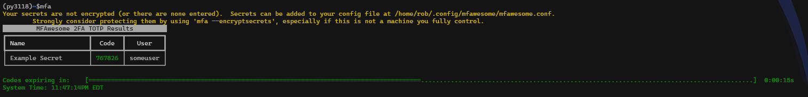

-   `filterterm`: this is the only positional argument and is used to
    filter using fuzzy matching (unless `--exact` is specified) against
    secretnames. However when using `--searchsecrets` it will match
    against text anywhere in the secret.
-   `--encryptsecrets`: encrypts your current config file in place

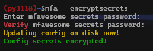

-   `--decryptsecrets`: decrypts your current config file in place
-   `--exportconfig`: creates a copy of your current config file with a
    new password and saves it in the current working directory (*Note:
    enables keylogprotection by default. This can always be disabled in
    the config file if desired*)

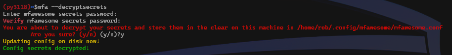

-   `--printconfig`: prints your \[decrypted\] config and exits

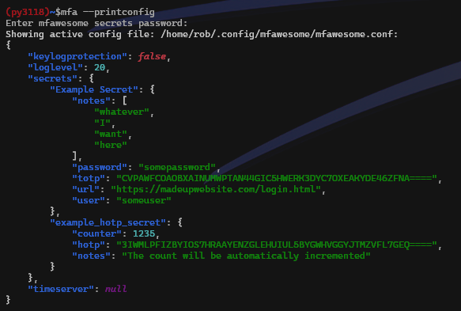

-   `--configdebug`: displays the config file resolution order and
    selected config file, similar to `pip config debug`

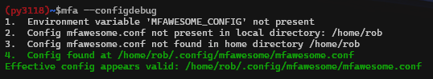

-   `-c, --continuous`: displays all secrets continuously for 120
    seconds, or the time specified in `--timeout` starting immediately.
    When the secrets get renewed if this timer is less than the time
    left on the secrets (30s), the timer will be set to match the
    secrets expiration to avoid killing the session on secrets that have
    not expired.


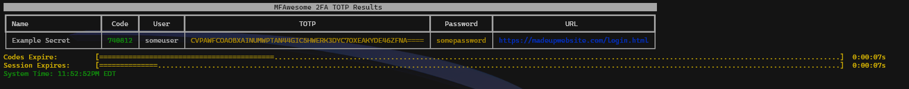

-   `-e, --exact`: matches \[the only optional positional argument\]
    `filterterm` against secret names exactly rather than using fuzzy
    matching
-   `-s, --showsecrets`: shows the secret metadata stored in the config
    file along with the ephemeral code (*use with caution*)

| :exclamation:  WARNING |
| ---------------------- |

Showing secrets will subject the to viewing by others as well as
terminal output logging. A warning is issued if the config option
`keylogprotection: true` is set.
:::

-   `-t, --noendtimer`: shows the current value of the calculated code
    and immediately exits
-   `-l, --noclearscreen`: disables clearing of the screen once secrets
    or continuous session is expired. (*use with caution in conjuntion
    with \`\`\--showsecrets\`\`*)

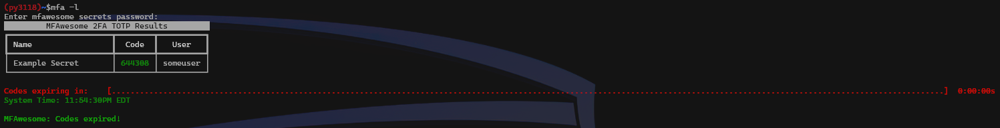

-   `-n, --now`: rather than waiting for new codes with enough time on
    them to be able to enter them, show the calculated code values
    immediately
-   `-r, --showerr`: show the short description/reason for any errors
    for codes in your config secrets
-   `--timeout`: was for ntpserver but i think i'm going to remove
-   `--loglevel`: string or integer: disabled (0), debug (10), info
    (20), warn (30), error (40), critical (50). The default value is
    info
-   `--hotp`: takes optional `filterterm` parameter and shows matching
    HOTP secrets. `--exact` is allowed

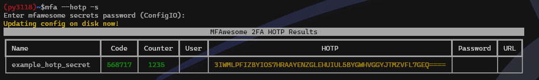

| :exclamation:  WARNING |
| ---------------------- |

Running in debug mode can output sensitive information to the terminal
and could potentially be logged. A warning is issued if the config
option `keylogprotection: true` is set.

-   `--generatesecret`: generate a valid OTP secret value and print it
    out to the screen (note that this does not get added to the config
    or saved anywhere)
-   `-z, -searchsecrets`: search through *all* secrets in your config
    using a required [filterterm]{.title-ref} and show you the results.
    This does not calculate and display TOTP or HOTP codes. If the
    [\--exact]{.title-ref} flag is set fuzzy matching will be disabled.

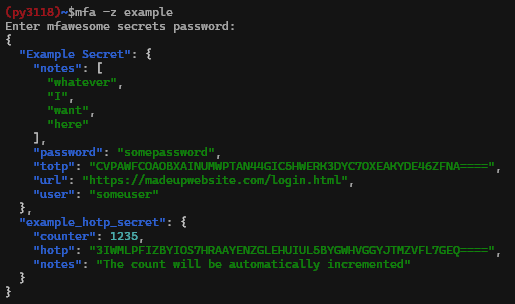

-   `--addqrsecrets TEXT`: this option requires the third party Rust
    libarary \[QRScan\](<https://github.com/sayanarijit/qrscan>) to be
    installed. The required term is the name of the directory containing
    screenshots/images of QR images from Google Authenticator you wish
    to import to your config

| :exclamation:  WARNING |
| ---------------------- |

**\*MFAwesome makes every attempt to ensure that your secrets are
cleared from the screen following execution unless you have explicitly
enabled \'\--noclearscreen/-l\', including on keyboard interrupt (SIGINT
signal). However, Ctrl+Z (SIGTSTP signal) will stop the processs without
leaving python a chance to clear output.**\*
:::

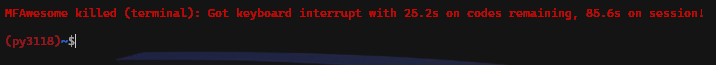

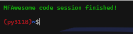

# Help Output

    $mfa --help
    Usage: mfa [OPTIONS] [FILTERTERM]

    Options:
    --encryptsecrets     Encrypt secrets in config file (if not already
                         encrypted)
    --decryptsecrets     Permanently decrypt secrets in config file (if
                         encrypted)
    --exportconfig       Export config to current directory.  Strong hashing and
                         keylog protection will be enabled.  Please see the
                         documentation for details
    --changepassword     Change password for secrets - unencrypted secrets are
                         never written to disk
    --generateconfig     Generate a new config file if one does not exit - add
                         your secrets there
    --printconfig
    -z, --searchsecrets  Search through all secrets for a filterterm and display
                         matching.  '--exact' flag is applicable
    --addsecrets TEXT    Add new secret(s), must be in format of {"secretname":
                         {"totp":"SECRETCODE", "user":"theduke",
                         "url":"www.example.com"}}.  Multiple secrets are
                         acceptable
    --removesecret TEXT  Remove a secret by specifying the secret name
    --addqrsecrets TEXT  Add secrets from QR images by specifying directory
                         containing the images
    --generatesecret     Generate and print a secret key and exit
    -c, --continuous     Enable continuous code display - default to 90 but add
                         optional argument for otherwise
    -e, --exact          Disable fuzzy matching on secret filterterm
    -s, --showsecrets    Enable showing secrets - WARNING: this will reveal
                         sensitive information on your screen
    -t, --noendtimer     Disable countdown timer for codes, N/A for --continuous
    -l, --noclearscreen  Disable clearing the screen before exit - WARNING - can
                         leave sensitive data on the screen
    -n, --now            Get codes now even if they expire very soon.  N/A for
                         continuous.
    -r, --showerr        Show errors getting codes
    --timeout FLOAT      Length of time to show codes continuously (seconds)
    --loglevel INTEGER   Integer log level 0, 10, 20, 30, 40, 50
    --configdebug        Show config file resolution details
    --hotp               Calculate HOTP codes, using a filterterm if supplied.
                         Counters will be incremented in the config
    --help               Show this message and exit.

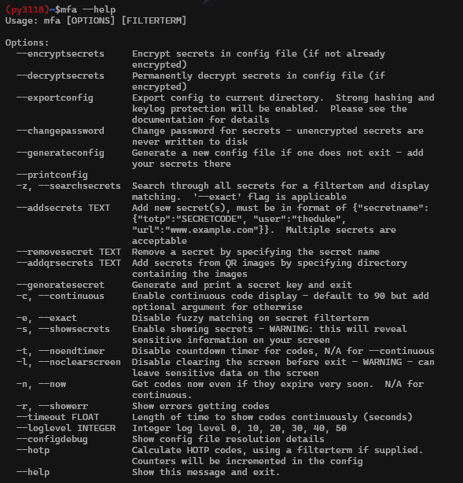

# Running From a Jupyter Notebook

``` python
from mfawesome.exec_mfawesome import run
run(now=True)
```

# License

MFAwesome is distributed under the license described in the `LICENSE` file.

# Author

Rob Milloy (\@rpm5099) <rob@milloy.net>
